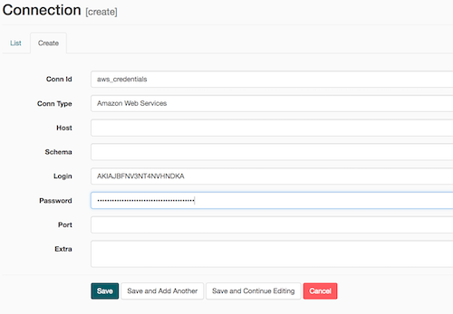
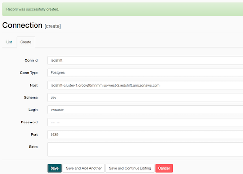
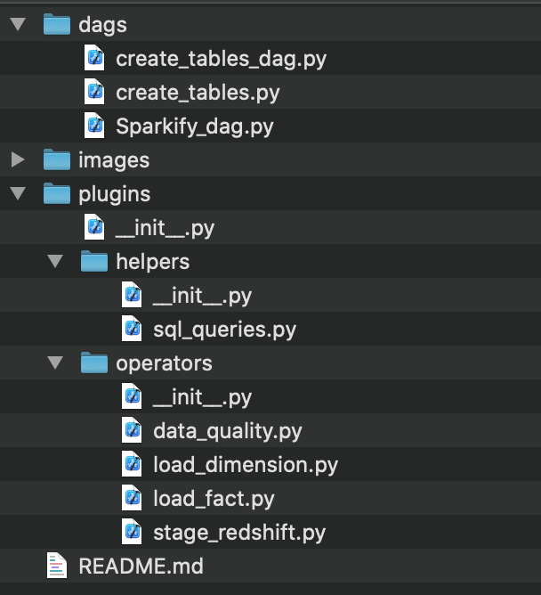
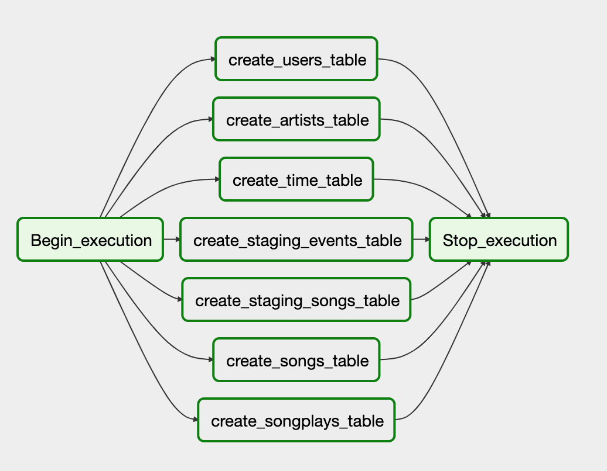
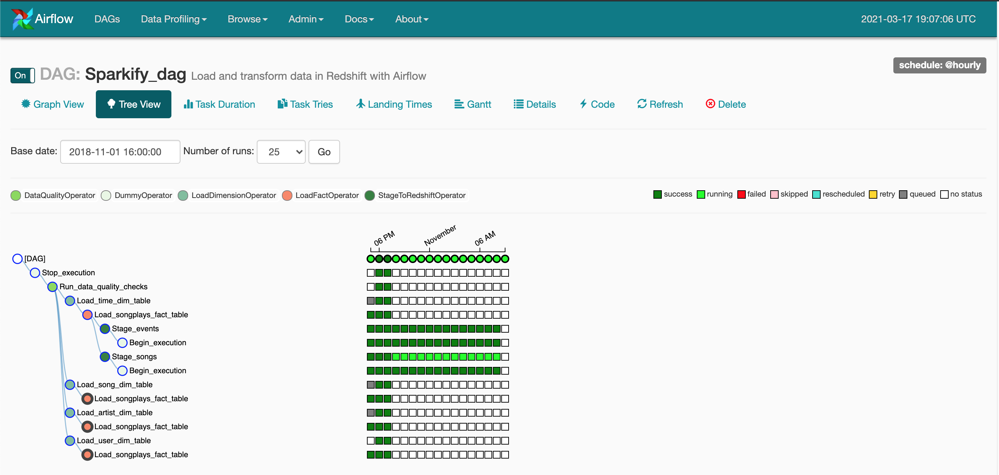
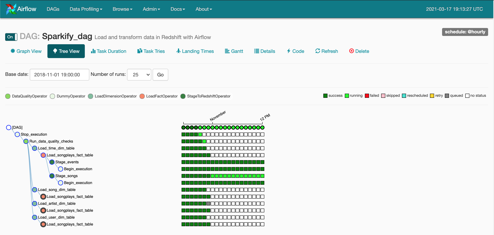

# Airflow Pipeline Project
## Introduction
In this project, we explore the **Apache Airflow** environment to automate, schedule and monitor an end-to-end data engineering pipeline for the Sparkify pseudo start-up. The source data resides in **AWS S3** and needs to be processed in Sparkify's data warehouse in **Amazon Redshift**. The source datasets consist of JSON logs that tell about user activity in the application and JSON metadata about the songs the users listen to.

## Redshift setup
To kick off the project, we needed to set up an instance of AWS Redshift as our data warehouse. We had already done this previously, so we could leverage the [Redshift Cluster Setup Jupyter Notebook](https://github.com/jfvanreu/AWS-DataWarehouse/blob/main/RedshitClusterSetup.ipynb) to perform this task.

Once we initiated the Redshift data warehouse, we could verify that it was up and running. We received an IP address and could log into it via AWS Console. 

## Launching Airflow
An Airflow server was provided to us for this project. Otherwise, check [Apache Airflow web-site](https://airflow.apache.org/) on how to install the Airflow server.
To start the server, we used the **/opt/airflow/start.sh** command.

## Airflow Connectors
Once the Airflow server is up and running, we need to create connections/hooks to the Redshift cluster which we launched previously. Those connections will be used as part of our operators/scripts.

**IMPORTANT NOTE:** Both Amazon Web Service and Redshift database hooks must be set with the right configuration for the airflow pipeline to succeed.

### Amazon Web Services hook
To connect to Redshift and S3, we need to have some AWS user credentials. Those can be set in the Airflow/Admin/Connections tab by filling in the following fields. 

Note that Redshift uses a "Postgres" connection type. Also, we need valid AWS credentials for a user that has access to Redshift cluster.

### Redshift database
We also need to define the settings of a redshift "hook". This allows us to connect to our Redshift cluster. When we created the Redshift cluster, we also created a database schema and user who can access this database. This information is key to connect to Redshift via Airflow. See below the info that needs to be provided.

## Folder structure
The airflow code is organized as below

The *dags* folder includes 3 files:
- create-tables-dag.py (used to create the project tables)
- create-tables.py (includes all the SQL queries to create tables)
- sparkify-dag.py (Sparkify dag project file)

The *plugins/operators* folder includes the operators defined to execute the various tasks included in the pipeline:
- stage_redshift.py: operator which copies data from S3 to Redshift staging tables.
- load-fact.py: operator which creates the FACT table (songplays) based on the staging tables.
- load-dimension.py: operator which populates the dimension tables using data from the staging tables.
- data-quality.py: operator which checks that the final data after the various pipeline operations.

The *helpers* folder includes the SQL queries to *upsert* data into our tables.

This readme.md file is also included in this folder structure.

## Creating tables in Redshift using a DAG
Before copying data to a database, we first needed to create the various staging and STAR model FACTS and DIMENSIONS tables. We decided to create a specific DAG to perform this operation. The DAG first deletes each table and then creates new one. This was a good way to get our feet wet with Airflow.

## Main Sparkify pipeline
We designed the main Sparkify pipeline as shown on the workflow diagram below.

The pipeline first connects to AWS S3 to collect songs and logs data. Using this data, it creates the FACT table SONGPLAYS which includes a history of the various songs played by customers. The pipeline also creates Dimension tables for Artists, Songs, Users, and Time. This is the STAR schema that we have used in previous Sparkify projects. The database schema is available below .

For this project, you'll be working with two datasets. Here are the s3 links for each:

Log data: s3://udacity-dend/log_data
Song data: s3://udacity-dend/song_data

The log data is partinioned by time (year, month). We made sure that Airflow only picked up the data that was relevant to its execution time. The script only looked at the data available at that time and didn't load the entire log data set.

The song data set was loaded for each run. This is a bit redundant when we backtrack (work in the past) since we transfer the same data from S3 over and over. However, we can assume that the Airflow pipeline would mostly be run on a daily basis in the future, so this situation wouldn't occur too often.  

As a last step in our pipeline, we perform some basic quality checks to verify that the tables have been populated as expected.

## Results
We ran our pipeline on a provided data set and within an allocated time frame (Nov 2018). The pipeline performed well as shown below.

Because we set a start date in the past, Airflow was smart enough to backtrack to that time and collect the matching data.

Using AWS Console UI, we could also connect to Reshift and verify that tables were populated with the relevant data.

## Lessons Learned
- Airflow scheduler was the most complex part to learn. I thought the following [blog](https://towardsdatascience.com/airflow-schedule-interval-101-bbdda31cc463) provided good information on how it works.

## Improvements opportunities
This project provides a good introduction to Airflow but it can be improved in multiple ways:
- Create some sub-dags to collect data from S3 and create dimension tables.
- Further develop the quality check operator
- The current quality operator "hard-coded" the check operation. It would beneficial to make the data quality operator more generalizable by moving the hardcoded tests outside the operator. In fact, we could provide a list of tests as parameters with their expected results.

  Code Example:

      for check in self.dq_checks:
          sql = check.get('check_sql')
          exp_result = check.get('expected_result')
      records = redshift.get_records(sql)[0]
      # compare with the expected results
      ...

  In dag, the tests can be specified as below:

    dq_checks=[
        {'check_sql': "SELECT COUNT(*) FROM users WHERE userid is null", 'expected_result': 0},
        {'check_sql': <Could be another test>, 'expected_result': 0}
    ]

## Conclusion
Overall, Airflow is a solid framework which provides an environment where we can automate and control our various data engineering tasks. Its user interface is intuitive; it is easy to track progress through the pipeline.
